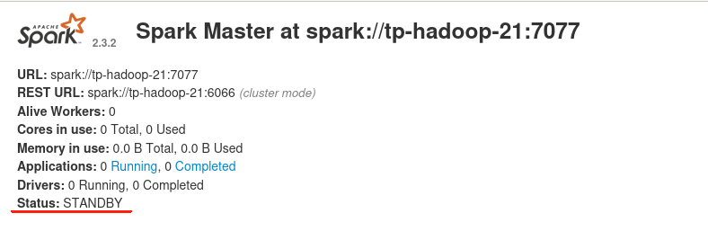

<hr style="border:3px solid black">

<h1 align="center">#Configuration de cluster#</h1>

<hr style="border:3px solid black">

La configuration de notre projet nécessite de configurer sur le server de l'école. On a **8** machines pour réaliser cette fonction:

- **2 Masters** ;

- **6 Slaves (ou Workers)**  qui sont utiliser pour stoquer des données;
  
  

Dans notre architecture, on décide d'utiliser logiciels: **Spark 2.3.2** et **Cassandra 3.11.3** ce qu'n a trouvé compatible. On a installé **3 Zookeepers** sur **2 masters** et **1 worker** pour assurer la résilience de nos travailles 


Notre documentation est organisée dans l'ordre suivant:

1. Lancer le cluster et y accéder

2. Configuration de JAVA et python

3. Installation et configuration de Appache Cassandra sur des **6** Workers du cluster

4. Installation et configuration de Appache Spark sur **8** machines

5. Installation et configuration de Appache Zookeeper sur  **2** Masters et **1** Worker

6. Installation et configuration de Appache Zeppelin sur **2** Masters
   
   

****


<h2 align="left">1.Lancer le cluster et y accéder</h2>

### 1.1 Connecter cluster

L'école nous a distribué 8 VMs pour configurer. Pour connecter, taper code sur terminal (Lunix):

```bash
ssh ubuntu@ip_server && ssh tp-hadoop-(Numéro de machine)
```


### 1.2 Création de clé public

Cette étape pour l'interconnexion parmi des machines. 

```bash
ssh-keygen -t rsa -b 4096
```

Notez que la clé doit être créée dans un fichier (**.ssh**). Une fois créée, tapez (**cat id_rsa.pub**) dans le même répertoire de fichiers pour obtenir la clé publique, et copiez cette clé publique dans le fichier de clés publiques (**authorizedkey**) des **7** autres machines.


### 1.3 l'ajout de IPs

Afin de garantir une connexion fluide entre les machines à un stade ultérieur, vous devez copier l'adresse IP de chaque machine sous le fichier (**/home/ubuntu/etc/hosts**).

Pour vérifier que la connexion a réussi, vous pouvez saisir le code :

```bash
ssh ubuntu@(ip de machine)
```


****

<h2 align="left">2.Configuration de JAVA et Python</h2>

### 2.1 Installer Java

L'installation de Java est cruciale. Il s'agit de l'environnement de travail du logiciel pour ce projet. Avant l'installation, il faut vérifier comptabilité des logiciels. Pous nous, on a choisi **java 8**:

```bash
sudo apt-get update && sudo apt-get upgrade && sudo apt-get install openjdk-8-jdk
```

Les deux premières commandes sont des commandes de mise à jour du système. Si le système est nouveaux, vous n'avez pas besoin d'exécuter.

Ensuite, vous devez ajouter le chemin d'accès à java à la variable d'environnement(**.barshrc**).

```bash
java -XshowSettings:properties -version # properties java
```

Le code ci-dessus permet de trouver le chemin d'accès à l'installation de Java.

```bash
export JAVA_HOME=/usr/lib/jvm/java-8-openjdk-amd64/jre
```

 Après l'avoir ajouté à la variable d'environnement, vous pouvez le vérifier en exécutant (**echo $$JAVA_HOME**).


### 2.2 Installer Python

Python peut être installé après l'installation de cassandra, car il nécessite des logiciels compatibles. S'il n'y a pas d'exigence de compatibilité, vous pouvez l'indiquer :

```bash
sudo apt install python
```


****

<h2 align="left">3.Installation et configuration de Cassandra</h2>

### 3.1 Installer Cassandra

Encore une fois, un rappel:vous devez vous assurer de la compatibilité des logiciels avant de les installer, faute de quoi vous passerez beaucoup de temps à chercher une solution au problème. Pour nous,  on a choisi **Cassandra 3.11.3** , dans le site de [site Apache Cassandra](http://www.apache.org/dyn/closer.lua/cassandra/3.11.3/) :

```bash
cd /home/ubuntu/ && wget http://archive.apache.org/dist/cassandra/3.11.3/apache-cassandra-3.11.3-bin.tar.gz && tar -xzvf apache-cassandra-3.11.3-bin.tar.gz
```

Si besoin, vous pouvez supprimer le fichier de gz :

```bash
rm -r apache-cassandra-3.11.3-bin.tar.gz
```

Ensuite, vous devez ajouter le chemin d'cassandra à la variable d'environnement(**.barshrc**)

```bash
export PATH="$PATH:/home/ubuntu/apache-cassandra-3.11.3/bin"
```


### 3.2 Configurer cassandra fichier <u>Cassandra.ymal</u>

  Pour activer la mise en cluster entre les nœuds, il faut configurer fichier(**<u>Cassandra.ymal</u>**). Dans le fichier, nous devons modifier des lignes suivant:

- **cluster_name** : nom de cluster(par defauct "Test Cluster")

- **seed_provider** : IPs de machines qui doivent faire le cluster

- **listen_address** : IP de machine actuelle qui laisse cluster trouve le noeud.

- **rpc_address** : 0.0.0.0 (ici, on peut mettre l'ip de machine actuelle, mais pour les connexions de cassandra, il faut ajouter ip après **cqlsh**)

- **broadcast_rpc_address** : 1.2.3.4(quand rpc_address est 0.0.0.0, il faut ajouter ce lignes, sinon, commenter cette ligne)

```
cluster_name: 'Test Cluster'

seed_provider:
    # Addresses of hosts that are deemed contact points. 
    # Cassandra nodes use this list of hosts to find each other and learn
    # the topology of the ring.  You must change this if you are running
    # multiple nodes!
    - class_name: org.apache.cassandra.locator.SimpleSeedProvider
      parameters:
          # seeds is actually a comma-delimited list of addresses.
          # Ex: "<ip1>,<ip2>,<ip3>"
          - seeds: "tp-hadoop-17,tp-hadoop-18,tp-hadoop-19,tp-hadoop-20,tp-hadoop-23,tp-hadoop-24"

listen_address: tp-hadoop-17
rpc_address: 0.0.0.0
broadcast_rpc_addres:1.2.3.4
```


Lorsque nous avons fini de configurer une machine, nous pouvons utiliser la commande **scp** pour la copier sur une autre machine.

```bash
    scp /home/ubuntu/apache-cassandra-3.11.3/conf/cassandra.yaml ubuntu@$node:/home/ubuntu/apache-cassandra-3.11.3/conf/
```


Grâce à la connexion entre les machines, nous pouvons écrire des fichiers **sh** pour un déploiement en un clic.

```bash
!/bin/bash
# Liste des noms d'hôtes ou adresses IP des nœuds
nodes=("ip_1" "ip_2" "ip_3" "ip_4","ip_5")

for node in "${nodes[@]}"; do
    # Supprimer l'ancien fichier cassandra.yaml
    ssh ubuntu@$node "rm /home/ubuntu/apache-cassandra-3.11.3/conf/cassandra.yaml"

    # Copier le fichier de base cassandra.yaml vers le nœud
    scp /home/ubuntu/apache-cassandra-3.11.3/conf/cassandra.yaml ubuntu@$node:/home/ubuntu/apache-cassandra-3.11.3/conf/

    # Modifier le fichier cassandra.yaml sur le nœud
    ssh ubuntu@$node "sed -i 's/listen_address:.*/listen_address: $node/' /home/ubuntu//home/ubuntu/apache-cassandra-3.11.3/conf/cassandra.yaml

done

```


### 3.3  Vérification de réussite

Lancer cassandra dans des machines:

```bash
cd /home/ubuntu/apache-cassandra-3.11.3 && bin/cassandra
```

Pour voir des nodes de cluster, le code suivant:

```bash
nodetool -h ::FFFF:127.0.0.1 status #(soit: nodetool status)
```

****

<h2 align="left">4.Installation et configuration de Spark</h2>

Spark propose aux utilisateurs deux mode de Cluster qui deployé indépendant : **Standalone** et **HA**(High availability) 

Dans cette partie, il s'agit de configuration sur le mode **Standalone** ,le deuxième sera présenté dans configuration de Zookeeper.

Un rappel, les étapes suivant pour réaliser la fonction cluster :

1. Installer Apache-SparK sur les Masters et Workers

2. Configurer des fichiers

3. Ajouter les dépendances pour connecter Spark et Cassandra

4. Lancer le cluster
   
   

### 4.1 Installer Spark

  Pour installation, on a choisi **Spark 2.3.2** , Vous pouvez chercher des vesion qui est compatible sur le [site](https://archive.apache.org/dist/spark/spark-2.3.2/) .

```bash
cd /home/ubuntu && wget https://archive.apache.org/dist/spark/spark-2.3.2/spark-2.3.2-bin-hadoop2.7.tgz && tar -xzvf spark-2.3.2-bin-hadoop2.7.tgz && rm spark-2.3.2-bin-hadoop2.7.tgz
```

Ensuite, vous devez ajouter le chemin d'Spark à la variable d'environnement(**.barshrc**)

```bash
export SPARK_HOME=/home/ubuntu/spark-2.3.2-bin-hadoop2.7
export PATH=$PATH:$SPARK_HOME/bin
```


### 4.2 Configurer des fichiers.

Accéder au dossier(**/home/ubuntu/spark-2.3.2-bin-hadoop2.7/conf**), Copier `spark-env.sh.template`,`slaves.template` et `spark-defaults.conf.template` en  `spark-env.sh` ,`slaves`  et  `spark-defaults.conf` . 

```bash
cd /home/ubunut/spark-2.3.2-bin-hadoop2.7/conf && cp spark-env.sh.template spark-env.sh && cp spark-defaults.conf.template spark-defaults.conf
```

Dans fichier de **spark-env.sh** :

```bash
export JAVA_HOME=/usr/lib/jvm/java-8-openjdk-amd64/jre
export SPARK_MASTER_HOST=tp-hadoop-21
export SPARK_MASTER_PORT=7077
```

**JAVA_HOME** : le chemin de JAVA

**SPARK_MASTER_HOST**: Ip adresse de master de cluster

**SPARK_MASTER_PORT**: Porte de master


Dans fichier de **slaves**:

```bash
tp-hadoop-21 #master
tp-hadoop-22 #slaves
tp-hadoop-20
tp-hadoop-17 ... 
```

Il faut faire l'attention de l'ordre des IPs de cluster, le premier toujours est le master.


Dans fichier de **spark-defaults.conf** :

```bash
spark.jars                          /home/ubuntu/spark-2.3.2-bin-hadoop2.7/jars/spark-cassandra-connector_2.11-2.4.0.jar
spark.cassandra.connection.host     tp-hadoop-17,tp-hadoop-18,tp-hadoop-19,tp-hadoop-20,tp-hadoop-23,tp-hadoop-24
```

**spark.jars** : Chemin de stockage de librairie de spark-cassandra connector 

**spark.cassandra.connection.host** : Ips de cassandra cluster, c'est pour conecter cassandra automatiquement.


Quand avoir fini des configurations dans une machine, on peut copier et coller dans des autres machines.


### 4.3 Installer Spark-cassandra-connector

Cette librairie est pour la connexion entre Spark et Cassandra.

```bash
cd /home/ubuntu/spark-2.3.2-bin-hadoop2.7/jars && wget https://repo1.maven.org/maven2/com/twitter/jsr166e/1.1.0/jsr166e-1.1.0.jar && wget https://repo1.maven.org/maven2/com/datastax/spark/spark-cassandra-connector_2.11/2.4.0/spark-cassandra-connector_2.11-2.4.0.jar
```


### 4.4  Lancer le cluster

Cette partie est Simple, dans le noeud de master:

```bash
cd /home/ubuntu/spark-2.3.2-bin-hadoop2.7/sbin && ./start-all.sh
```

Le lien de Web est : **ip_master:8080** , si le cluster marche bien, il ne peut pas afficher interface, c'est  peut-être le problème porte(**corrigé sur spark-env.sh**).

****

<h2 align="left">5.Installation et configuration de Zookeeper</h2>

Pour le mode HA, Il faut installer Zookeeper(Zk). La fonction de Zk est pour assurer la continuité d'une tâche, c'est-à-dire que, quand une une noeud est tombé, le deuxieme master copiera et continuer la tâche. En général, dans ce mode,  il utilise un noeud de woker comme master alternative. Donc , il faut choisir au moins de 3 machines afin de réaliser la focntion de Zk(**2 master** et **1 woker**)


### 5.1 Installer Zookeeper

Dans notre projet, on a installé **Zookeeper_3.5.6** sur 1 Master et 2 Workers. Vous pouvez chercher la version compatible avec vos logiciels sur le [site](http://archive.apache.org/dist/zookeeper) . Le command est suivant:

```bash
wget http://archive.apache.org/dist/zookeeper/zookeeper-3.5.6/apache-zookeeper-3.5.6-bin.tar.gz && tar -xzvf apache-zookeeper-3.5.6-bin.tar.gz && rm apache-zookeeper-3.5.6-bin.tar.gz
```


### 5.2 Configurer Zookeeper

1. Dans Zookeeper, il ne crée pas automatiquement des fichiers qui stockent des données et des logs,il faut créer:

```bash
cd /home/ubuntu/ && mv apache-zookeeper-3.5.6-bin/zookeeper_X 
```

```bash
cd /home/ubuntu/zookeeper_X && mkdir data && mkdir logs
```

**zookeeper_X** est pour éviter la confusion pendant la configuration suite.


   2. Créer un fichier **myid** qui contenant un digit correspondant au numéro de série du zookeeper.  Sil le nom de fichier **zookeeper_X** est zookeeper_1,  ce numéro est 1.

```bash
cd /home/ubuntu/zookeeper_X/data && nano myid
```


   3.Configurer fichier **zoo.cfg** . Accéder à fichier (**/home/ubuntu/zookeeper_X/conf**):

```bash
cp zoo_sample.cfg zoo.cfg && nano zoo.cfg
```

Dans fichier **zoo.cfg**, il faut modifier des lignes:

- **datadir**  : chemin de data dans zookeeper_X;

- **clientPort** : 218X, ici, le même numéo de **zookeeper_X** (par default 2181, pouvoir ne modifier:);

- des lignes de Servers: **server.1**,**server.2**,**server.3**...

C'est la configuration d'un fichier:

```bash
dataDir=/export/data/zookeeper_x/zkdata
clientPort=2181
server.1=ip_master:2891:3881
server.2=ip_master_alternative:2892:3882
server.3=ip_slave1:2893:3883
```

Attention, l'ordre de server doit être pareille que celui dans fichier (**slaves**). 


### 5.3 Reconfigurer ***Spark-env.sh***

Une fois en fini, il faut reconfigurer la fichier (**Spark-env.sh**). Commenter la définition de Ip adresse de master, et ajouter  des lignes:

```bash
export SPARK_MASTER_WEBUI_PORT=38080
export SPARK_WORKER_WEBUI_PORT=38081
export SPARK_DAEMON_JAVA_OPTS="-Dspark.deploy.recoveryMode=ZOOKEEPER -Dspark.deploy.zookeeper.url=tp-hadoop-21:2181,tp-hadoop-22:2182,tp-hadoop-20:2183 -Dspark.deploy.zookeeper.dir=/spark"
```

**Dspark.deploy.recoveryMode** : Configurer Zookeeper pour le mode alternatif

**Dspark.deploy.zookeeper.url** : Chemin de zookeeper servers(ip:clientport dans fichier de **zoo.cfg**)

**Dspark.deploy.zookeeper.dir** : Fichiers et répertoires contenant des informations sur les métadonnées des clusters


Dans notre projet, on a rencontré le problème de porte, c'est pourquoi qu'on a ajouté des lignes de porte. Ensuite, faire la même chose dans les autres machines.


### 5.4 Lancer cluster

Lancement est un peu différent que celui dans mode standalone, c'est **obligé** de **démarrer Zk tout d'board** (en l'ordre de configuration). Suivant,dans le noeud **master** (le premier dans **slaves**):

```bash
cd /home/ubuntu/spark-2.3.2-bin-hadoop2.7/sbin && ./start-all.sh
```

Dans noeud de **master alternative**:

```bash
cd /home/ubuntu/spark-2.3.2-bin-hadoop2.7/sbin && ./start-master.sh
```

Le lien de l'interface sera **ip_master:38080** pour master (**ip_worker:38081** pour worker). Pour le test, vous pouvez tomber le noeud de master ce qui en travail. Il faut attendre 30s ou 1min. Après, les tâches sont transmises en deuxième noeud.


Ci-desous sont des photos de l'interface de master spark. Le noeud en travail affiche le statut : ALIVE, le noeud en alternative est en STANDBY.

|  |  |
|:--------------------------------------------------------------:|:----------------------------------------------------------------:|

  ****

<h2 align="left">6.Installation et configuration de Zeppelin</h2>

### 6.1 Installer Zeppelin

On télécharge l'archive, la décompresse et la supprime en étant dans le (**/home/ubuntu**) :

```bash
wget https://www-eu.apache.org/dist/zeppelin/zeppelin-0.8.2/zeppelin-0.8.2-bin-all.tgz && tar -xzvf zeppelin-0.8.2-bin-all.tgz && rm zeppelin-0.8.2-bin-all.tgz 
```


### 6.2 Configuratrion de  Zeppelin

Dans Zeppelin, il n'y a pas beaucoup de chose à configurer, seulement fichier(**zeppelin-env.sh** , **zeppelin-site.xml**)

```bash
cd zeppelin-0.8.2-bin-all/conf
cp zeppelin-env.sh.template zeppelin-env.sh && cp zeppelin-site.xml.template zeppelin-site.xml
```


Dans le fichier **zeppelin-env.sh** :

```bash
export ZEPPELIN_PORT=9090                          # port number to listen (default 8080) 
```

C'est  pour éviter de l'occupation de porte.


Dans le fichier **zeppelin-site.xml** :

```bash
<property>   
        <name>zeppelin.server.addr</name>   
        <value>tp-hadoop-22</value>   
        <description>Server binding address</description> 
</property>  
<property>   
        <name>zeppelin.server.port</name>   
        <value>9090</value>   
        <description>Server port.</description> 
</property>  
```

Il faut assurer l'ip de server et la porte est pareil que celui dans **zeppelin-env.sh** .

 

### 6.3 Lancer Zeppelin


Pour lancer ce logiciel, accéder à fichier(**/home/ubuntu/zeppelin-0.8.2-bin-all/bin**)  :

```bash
./zeppelin-daemon.sh start(/stop)
```

Le lien de site est server:port(tp-hadoop-22:9090). 


