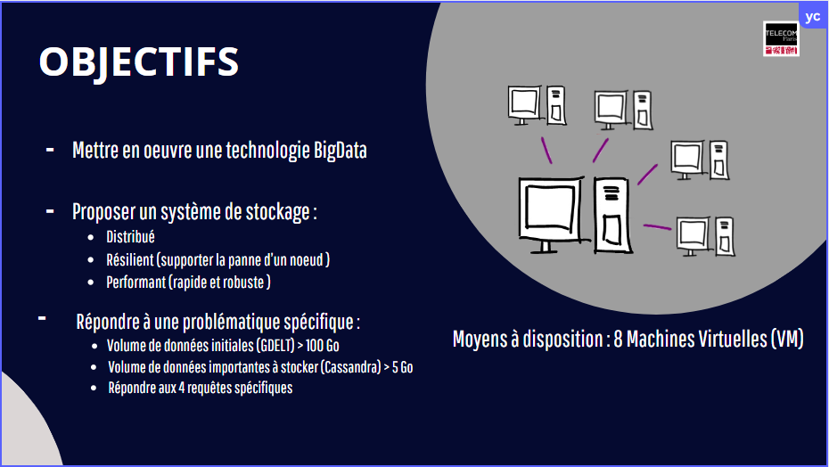

# Analyse des données NoSQL de GDELT

****
Le projet GDELT est une base de données mondiale qui collecte, analyse et met à jour en temps réel les événements médiatiques mondiaux issus de millions de sources d’information dans plus de 100 langues.
Il fournit :
- Une base d’événements géopolitiques (manifestations, conflits, accords, etc.) ; 
- Une base de connaissance sémantique (personnes, lieux, thèmes, émotions) ; 
- Des indicateurs de tonalité et sentiment ; 

****
# Les échantillons de GDELT travaillés
On se concentre sur deux bases de données :

## 1. **GDELT Events Database**  
   - Contient les **événements géopolitiques** identifiés dans l’actualité (protestations, conflits, accords, etc.).
   - Champs utilisés :
     - `GlobalEventId`
     - `ActionGeo_CountryCode` (pays de l'événement)
     - `EventDate`, `MonthYear`, `Year`
     - `MentionTranslationInfo` (langue de l’article)
     - `MentionTimeDate`
   - Utilisation :
     - Suivi des événements par pays, date et langue
     - Analyse de relations bilatérales (ex : France – Chine)

## 2. **Global Knowledge Graph (GKG)**  
   - Extrait des **entités, thèmes et sentiments** des articles d’actualité.
   - Champs utilisés :
     - `GkgRecordId`
     - `SourceCommonName` (nom du média)
     - `Themes`, `Persons`, `Locations`
     - `AverageTone` (tonalité moyenne)
     - `Date`, `MonthYear`, `Year`
   - Utilisation :
     - Analyse du contenu médiatique par source
     - Identification des sujets et personnalités abordés
     - Calcul du ton moyen des articles

---

****

***

